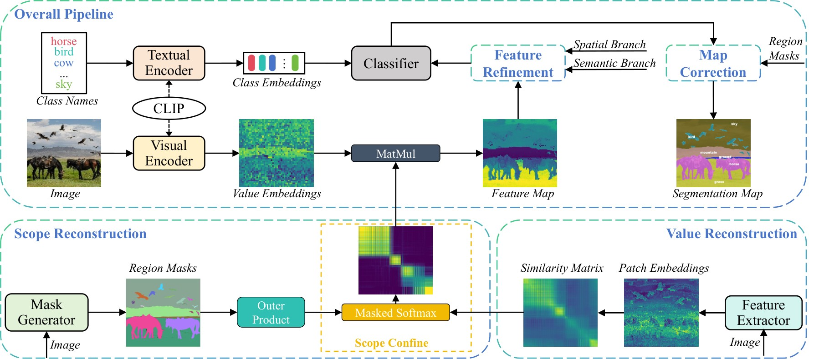
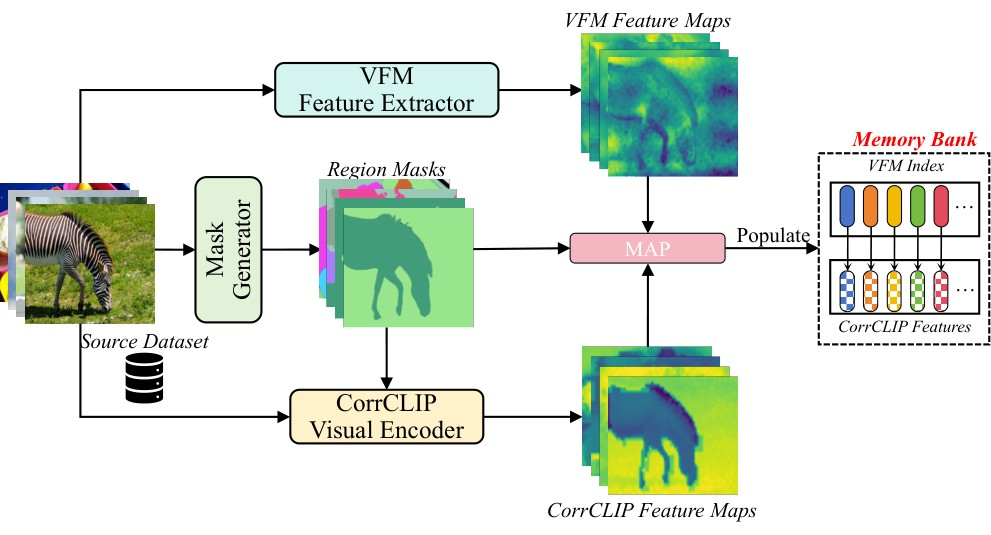
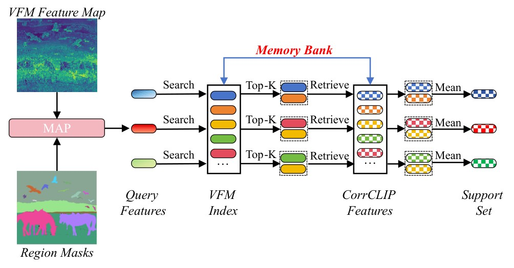

<div align="center">

# CorrCLIPv2: Harnessing Unlabeled Images for Open-Vocabulary Semantic Segmentation

**Journal extension of CorrCLIP (ICCV 2025 Oral)**

</div>

## 📄 Overview

CorrCLIPv2 augments single-image open-vocabulary segmentation with cross-image semantic support, retrieved from an offline memory bank built purely from unlabeled images — no annotation, no caption, no training. Two components are added:

<p align="center">
   
</p>

---

<p align="center">
   
   &nbsp;&nbsp;&nbsp;
   
</p>

VFM-Indexed Semantic Retrieval (VISR) builds the bank: a mask generator produces class-agnostic region masks for each unlabeled image, and Mask Average Pooling (MAP) extracts one embedding per region from the VFM and CorrCLIP feature maps — VFM embeddings become the indexing keys (a FAISS index), CorrCLIP embeddings the semantic values.

At inference, the test image's regions are pooled into VFM queries; each query retrieves its Top-K neighbors from the index, and the returned CorrCLIP values are averaged into support features and fused with the image's own prediction. Retrieval runs in VFM space, decoupled from text and vocabulary.

Decoupled Multi-CLIP Ensemble (DMCE) stores region features from multiple CLIP variants under the same VFM index, so auxiliary CLIP representations (DFN by default) are retrieved instead of recomputed at inference — ensemble gains at ~3 ms retrieval overhead.

## 📦 Dependencies

```
# git clone this repository
git clone https://github.com/zdk258/CorrCLIP.git
cd CorrCLIP/CorrCLIPv2

# create new anaconda env (my conda version is 25.5.1)
conda create -n CorrCLIP python=3.10
conda activate CorrCLIP

# install dependencies
pip install torch==2.1.2 torchvision==0.16.2 torchaudio==2.1.2 --index-url https://download.pytorch.org/whl/cu121
pip install -U openmim
mim install mmengine==0.10.7
mim install mmcv==2.1.0
pip install mmsegmentation==1.2.2
pip install -r requirements.txt
conda install -c pytorch faiss-gpu=1.9.0

# EntitySeg mask generator (the default): install Detectron2
python -m pip install --no-build-isolation 'git+https://github.com/facebookresearch/detectron2.git'

# install CropFormer and EntityAPI 
cd mask_generators/CropFormer/entity_api/PythonAPI
make
cd -  # back to CorrCLIPv2/
cd mask_generators/CropFormer/mask2former/modeling/pixel_decoder/ops
python setup.py build install
cd -
```

## ⚙️ Mask Generators & VFMs

### Mask Generator

Selected by `mask_generator` in [base_config.py](configs/base_config.py) (deployment) and `--mask_model` of [build.py](memory_bank_builder/build.py) (bank building); implementations live in [mask_generators/](mask_generators/).

| Option | Weights |
|---|---|
| `None` (pre-generated masks for reproducing the paper) | [instance_mask.zip](https://huggingface.co/datasets/dk258/CorrCLIPv2/resolve/main/instance_mask.zip?download=true) → extract to `data/`, giving `data/instance_mask/{voc,context,coco,ade,ade847,city}/` as `instance_mask_path` expects |
| `entityseg` (default) | [Mask2Former_hornet_3x](https://huggingface.co/datasets/qqlu1992/Adobe_EntitySeg/tree/main/CropFormer_model/Entity_Segmentation/Mask2Former_hornet_3x) → `Mask2Former_hornet_3x_576d0b.pth` at the repository root |
| `eomt` | downloads automatically from Hugging Face on first run |
| `sam2` | [sam2_hiera_large](https://dl.fbaipublicfiles.com/segment_anything_2/072824/sam2_hiera_large.pt) → `data/sam2_hiera_large.pt` |
| `sam` | [sam_vit_h](https://dl.fbaipublicfiles.com/segment_anything/sam_vit_h_4b8939.pth) → `data/sam_vit_h_4b8939.pth`, plus `pip install segment-anything` |

### VFM

`vfm_type` in [base_config.py](configs/base_config.py) selects the deployment VFM (correlation matrix, retrieval queries, and which index `{bank}_{vfm_type}.faiss` is loaded); `--vfm` of [build.py](memory_bank_builder/build.py) selects the bank-building VFM — the two must match. Implementations live in [vfms/](vfms/).

| Option | Weights |
|---|---|
| `radiov3` (default) — C-RADIOv3-L | downloads automatically via torch.hub |
| `radiov2.5` — RADIOv2.5-L | downloads automatically via torch.hub |
| `dinov2` — DINOv2-L | downloads automatically via torch.hub |
| `dinov3` — DINOv3-L | downloads automatically via torch.hub |
| `pe` — PE-Spatial-L14-448 | downloads automatically from Hugging Face, or place `PE-Spatial-L14-448.pt` at the repository root |

## 🗂️ Memory Bank Construction

A bank is a set of single-file `.pt` feature stores plus a FAISS retrieval index under `memory_bank/`. Build one from any image directory with a single command:

```
python memory_bank_builder/build.py --img /path/to/images --data_name mybank
```

The pipeline runs four steps and stops at the first failure; rerunning the same command resumes, and rerunning after adding images extends the bank incrementally:

1. `generate_mask` — instance masks → `memory_bank/masks/{bank}/{mask_model}/`
2. `build_manifest` — region-id registry → `memory_bank/manifests/{bank}.*`
3. `generate_clip_embeddings` — CLIP region features (one store per `--clip`) → `memory_bank/clip_embeddings/{bank}_{encoder}.pt`
4. `generate_vfm_embeddings` — VFM region features + FAISS index → `memory_bank/vfm_embeddings/{bank}_{vfm}.faiss`

Each `.pt` store is an `[N, D]` fp16 tensor loaded fully into RAM at startup; its row index is the region id fixed by the manifest, and the FAISS index (IDMap2) returns the same ids, so search results index the stores directly.

Key options:

- `--data_name`: bank name — keys every output file above; rerunning the same name resumes or extends that bank, a new name starts another.
- `--mask_model`: `entityseg` (default) / `eomt` / `sam` / `sam2`.
- `--gpus`: e.g. `--gpus 0,1`; unset uses the current `CUDA_VISIBLE_DEVICES` (all steps are multi-GPU parallel).
- `--clip`: CLIP stores to generate; default `meta_b dfn_b` (primary + auxiliary), `meta_l dfn_b` for the large model.
- `--vfm`: VFM for the retrieval index — `radiov3` (default) / `radiov2.5` / `dinov2` / `dinov3` / `pe`; must match `vfm_type` at deployment.

### Prebuilt banks

The two banks used in the paper can be downloaded instead of built. One configuration needs exactly three files — a main store matching the CLIP scale, the DFN auxiliary store, and the FAISS index — so pick a row and download only those.

| Configuration | Files to download | Total |
|---|---|---|
| **CorrCLIPv2-L** + `coco` (main results) | [coco_metaclip_l.pt](https://huggingface.co/datasets/dk258/CorrCLIPv2/resolve/main/memory_bank/clip_embeddings/coco_metaclip_l.pt?download=true) 4.2G · [coco_dfnclip_b.pt](https://huggingface.co/datasets/dk258/CorrCLIPv2/resolve/main/memory_bank/clip_embeddings/coco_dfnclip_b.pt?download=true) 2.8G · [coco_radiov3.faiss](https://huggingface.co/datasets/dk258/CorrCLIPv2/resolve/main/memory_bank/vfm_embeddings/coco_radiov3.faiss?download=true) 190M | 7.2G |
| **CorrCLIPv2-B** + `coco` | [coco_metaclip_b.pt](https://huggingface.co/datasets/dk258/CorrCLIPv2/resolve/main/memory_bank/clip_embeddings/coco_metaclip_b.pt?download=true) 2.8G · [coco_dfnclip_b.pt](https://huggingface.co/datasets/dk258/CorrCLIPv2/resolve/main/memory_bank/clip_embeddings/coco_dfnclip_b.pt?download=true) 2.8G · [coco_radiov3.faiss](https://huggingface.co/datasets/dk258/CorrCLIPv2/resolve/main/memory_bank/vfm_embeddings/coco_radiov3.faiss?download=true) 190M | 5.8G |
| **CorrCLIPv2-L** + `monet` (synthetic, disjoint) | [monet_metaclip_l.pt](https://huggingface.co/datasets/dk258/CorrCLIPv2/resolve/main/memory_bank/clip_embeddings/monet_metaclip_l.pt?download=true) 2.2G · [monet_dfnclip_b.pt](https://huggingface.co/datasets/dk258/CorrCLIPv2/resolve/main/memory_bank/clip_embeddings/monet_dfnclip_b.pt?download=true) 1.4G · [monet_radiov3.faiss](https://huggingface.co/datasets/dk258/CorrCLIPv2/resolve/main/memory_bank/vfm_embeddings/monet_radiov3.faiss?download=true) 108M | 3.7G |
| **CorrCLIPv2-B** + `monet` | [monet_metaclip_b.pt](https://huggingface.co/datasets/dk258/CorrCLIPv2/resolve/main/memory_bank/clip_embeddings/monet_metaclip_b.pt?download=true) 1.4G · [monet_dfnclip_b.pt](https://huggingface.co/datasets/dk258/CorrCLIPv2/resolve/main/memory_bank/clip_embeddings/monet_dfnclip_b.pt?download=true) 1.4G · [monet_radiov3.faiss](https://huggingface.co/datasets/dk258/CorrCLIPv2/resolve/main/memory_bank/vfm_embeddings/monet_radiov3.faiss?download=true) 108M | 3.0G |

Put the `.pt` files in `memory_bank/clip_embeddings/` and the `.faiss` file in `memory_bank/vfm_embeddings/`, keeping the filenames unchanged — the loader resolves each by name. Then set `_clip_scale` and `_mb_bank` in [base_config.py](configs/base_config.py) to match the row you chose and run as usual; `vfm_type` stays `radiov3`, the space these indexes were built in. For the no-DMCE ablation, set `use_aux_model=False` and skip the DFN store.

The image lists behind the disjoint banks are released for auditing: [gpic](https://huggingface.co/datasets/dk258/CorrCLIPv2/resolve/main/memory_bank/bank_images_gpic.txt?download=true), [monet](https://huggingface.co/datasets/dk258/CorrCLIPv2/resolve/main/memory_bank/bank_images_monet.txt?download=true), [sa1b](https://huggingface.co/datasets/dk258/CorrCLIPv2/resolve/main/memory_bank/bank_images_sa1b.txt?download=true) — one source image path per line, the exact set each bank was built from.

The default `coco` bank is built from the ~118k raw images of COCO train2017 with the options above; the disjoint synthetic `monet` bank is built the same way from MONET(Z-Image) samples. The disjoint-bank source images are downloadable from [SA-1B](https://ai.meta.com/datasets/segment-anything/), [GPIC](https://huggingface.co/datasets/stanford-vision-lab/gpic), and [MONET](https://huggingface.co/datasets/jasperai/monet) (its Z-Image synthetic subset). To evaluate with a bank, set `_mb_bank` in [base_config.py](configs/base_config.py) to its name. If the bank was built with a non-default `--vfm`, also set `vfm_type` to the same value, so that the loaded index `{bank}_{vfm_type}.faiss` and the retrieval queries share one feature space; `mask_generator` may differ from the bank's `--mask_model`, as it only controls the inference-side proposals.

## 📊 Evaluation

### Ten standard benchmarks

`With background class`: PASCAL VOC (VOC21), PASCAL Context (PC60), and COCO Object.

`Without background class`: VOC20, Context59 (VOC21/PC60 without the background category), Context459, COCO-Stuff164k, ADE20k (A150), ADE847, and Cityscapes.

Prepare Context459 and ADE847 following [CAT-Seg](https://github.com/KU-CVLAB/CAT-Seg/tree/main/datasets), and the others following the [MMSeg data preparation document](https://github.com/open-mmlab/mmsegmentation/blob/main/docs/en/user_guides/2_dataset_prepare.md). Convert COCO Object from COCO-Stuff164k:

```
python datasets/cvt_coco_object.py PATH_TO_COCO_STUFF164K -o PATH_TO_COCO164K
```

Place the datasets under `data/` at the repository root, using the directory names VOC2012, VOC2010, coco, ADEChallengeData2016, ADE20K_2021_17_01 and cityscapes — this is what `data_root` in each `configs/cfg_*.py` already points to, so no config edit is needed. All paths in the configs are relative to the repository root; if your data lives elsewhere, either symlink it into `data/` or edit `data_root`.

### MESS benchmark

Prepare the 22 datasets with the official [MESS repository](https://github.com/blumenstiel/MESS) and place them under the same `data/` root (e.g. `data/CHASEDB1`), matching `data_root` in `configs/mess/cfg_*.py`.

### Running

```
# single-GPU:
python eval.py --config configs/cfg_DATASET.py

# multi-GPU:
bash dist_test.sh configs/cfg_DATASET.py NUM_GPU

# all ten standard benchmarks (EVAL_NGPU sets the GPU count, default 2):
EVAL_NGPU=4 python eval_standard.py

# all 22 MESS datasets:
EVAL_NGPU=4 python eval_mess.py
```

### Results

mIoU on the ten standard benchmarks. All rows use RADIOv3-L and EntitySeg; -B/-L is the MetaCLIP scale (ViT-B/16 or ViT-L/14), and CorrCLIPv2 additionally ensembles DFN-B through the bank. The Bank column names the memory bank: COCO (default) is in-domain for the COCO benchmarks, while SA-1B, GPIC, and the fully synthetic MONET are image-level disjoint from all ten benchmarks.

#### MetaCLIP ViT-B/16

|    Method    | Bank  | VOC21 | VOC20 | PC60 | PC59 | Object | Stuff | ADE  | City | ADE847 | PC459 | Avg  |
|:------------:|:-----:|:-----:|:-----:|:----:|:----:|:------:|:-----:|:----:|:----:|:------:|:-----:|:----:|
|  CorrCLIP-B  |   –   | 75.8  | 89.9  | 45.9 | 50.8 |  45.4  | 32.6  | 28.6 | 53.7 |  10.5  | 11.8  | 44.5 |
| CorrCLIPv2-B | COCO  | 82.2  | 93.6  | 50.8 | 56.3 |  54.6  | 38.5  | 33.2 | 58.7 |  11.7  | 16.8  | 49.6 |
| CorrCLIPv2-B | MONET | 81.9  | 93.3  | 50.1 | 55.3 |  52.8  | 37.8  | 32.3 | 58.8 |  12.2  | 17.3  | 49.2 |
| CorrCLIPv2-B | SA-1B | 81.9  | 93.4  | 50.6 | 55.4 |  49.9  | 37.9  | 31.9 | 58.3 |  11.5  | 17.3  | 48.8 |
| CorrCLIPv2-B | GPIC  | 82.9  | 93.2  | 50.7 | 56.0 |  50.6  | 37.5  | 32.5 | 58.9 |  12.2  | 17.3  | 49.2 |

#### MetaCLIP ViT-L/14

|    Method    | Bank  | VOC21 | VOC20 | PC60 | PC59 | Object | Stuff | ADE  | City | ADE847 | PC459 | Avg  |
|:------------:|:-----:|:-----:|:-----:|:----:|:----:|:------:|:-----:|:----:|:----:|:------:|:-----:|:----:|
|  CorrCLIP-L  |   –   | 79.5  | 92.2  | 47.0 | 53.1 |  52.2  | 35.4  | 32.9 | 56.0 |  14.5  | 15.2  | 47.8 |
| CorrCLIPv2-L | COCO  | 82.3  | 93.2  | 51.1 | 56.8 |  58.0  | 39.1  | 36.5 | 59.2 |  14.9  | 18.6  | 51.0 |
| CorrCLIPv2-L | MONET | 82.7  | 93.4  | 50.3 | 55.9 |  56.2  | 38.6  | 34.9 | 59.2 |  15.0  | 18.8  | 50.5 |

## 🙏 Acknowledgement

Our implementation is based
on [ClearCLIP](https://github.com/mc-lan/ClearCLIP), [ProxyCLIP](https://github.com/mc-lan/ProxyCLIP), [DINO](https://github.com/facebookresearch/dino), [SAM2](https://github.com/facebookresearch/sam2), [Mask2Former](https://github.com/facebookresearch/Mask2Former), [EoMT](https://github.com/tue-mps/EoMT),
and [EntitySeg](https://github.com/qqlu/Entity/blob/main/Entityv2/README.md). Thanks for their awesome work!
