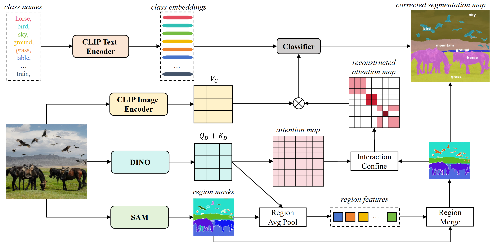
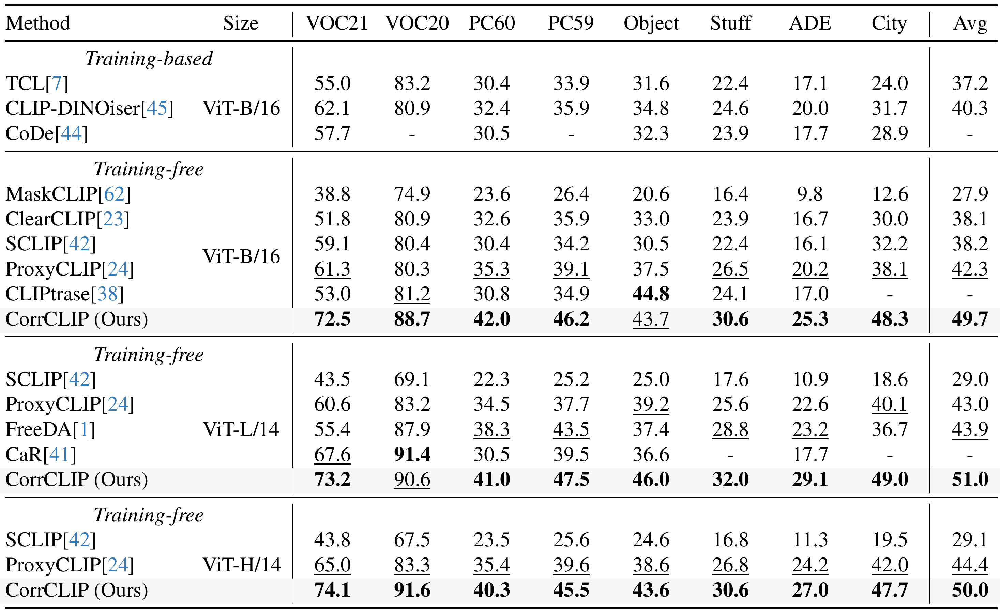
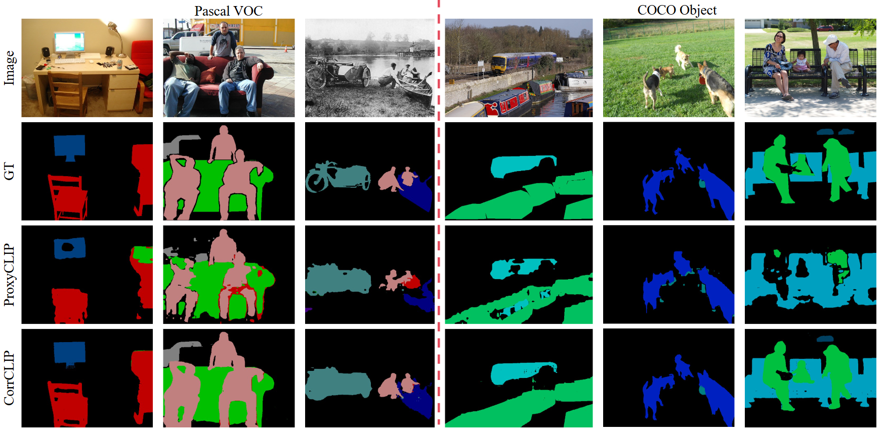

<h1>CorrCLIP: Reconstructing Correlations in CLIP with Off-the-Shelf Foundation Models for Open-Vocabulary Semantic Segmentation</h1>

    <h4 align="center">
        
    </h4>

> **Code will be released.**

## Abstract

> *Open-vocabulary semantic segmentation aims to assign semantic labels to each pixel without relying on a predefined set of categories. Contrastive Language-Image Pre-training (CLIP) demonstrates
outstanding zero-shot classification capabilities but struggles with the pixel-wise segmentation task as the captured inter-patch correlations correspond to no specific visual concepts. Despite
previous CLIP-based works improving inter-patch correlations by self-self attention, they still face the inherent limitation that image patches tend to have high similarity to outlier ones. In this
work, we introduce CorrCLIP, a training-free approach for open-vocabulary semantic segmentation, which reconstructs significantly coherent inter-patch correlations utilizing foundation models.
Specifically, it employs the Segment Anything Model (SAM) to define the scope of patch interactions, ensuring that patches interact only with semantically similar ones. Furthermore, CorrCLIP obtains
an understanding of an image's semantic layout via self-supervised models to determine concrete similarity values between image patches, which addresses the similarity irregularity problem caused by
the aforementioned restricted patch interaction regime. Finally, CorrCLIP reuses the region masks produced by SAM to update the segmentation map. As a training-free method, CorrCLIP achieves a notable
improvement across eight challenging benchmarks regarding the averaged mean Intersection over Union, boosting it from 44.4% to 51.0%.*

## Framework

## Result

## Visualization

