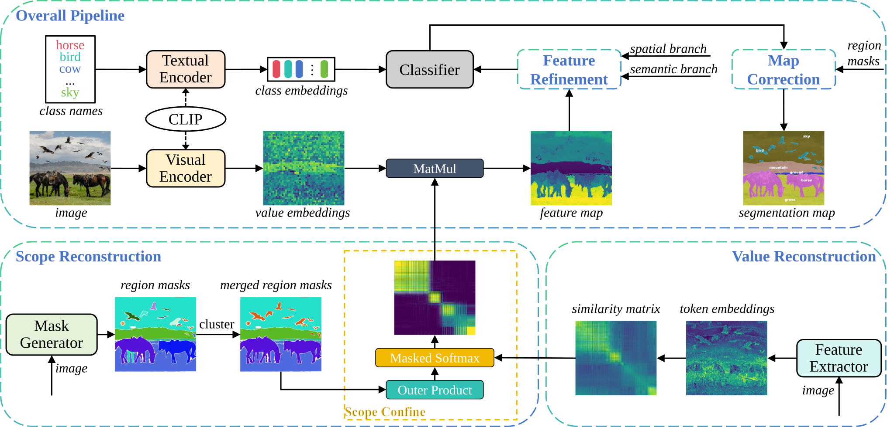
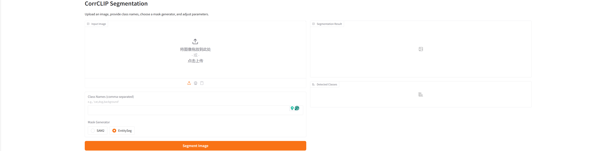

<div align="center">

# CorrCLIP: Reconstructing Patch Correlations in CLIP for Open-Vocabulary Semantic Segmentation

<div>
    <a href='https://arxiv.org/abs/2411.10086' target='_blank'>
        
    </a>
</div>

**Accepted to ICCV 2025**

</div>

## 📄 Overview

<div align="center">
   
</div>

> *We reveal that inter-class correlations impairs CLIP's segmentation performance. Accordingly, we propose CorrCLIP, which reconstructs the scope and value of patch correlations to reduce inter-class
correlations.
Additionally, we leverage two additional branches to strengthen final patch features. Finally, we update segmentation maps with generated masks to improve spatial consistency. CorrCLIP achieves
superior performance across eight benchmarks.*

## 📦 Dependencies

```
# git clone this repository
git clone https://github.com/zdk258/CorrCLIP.git
cd CorrCLIP

# create new anaconda env
conda create -n CorrCLIP python=3.10
conda activate CorrCLIP

# install dependencies
pip install torch==2.1.2 torchvision==0.16.2 torchaudio==2.1.2 --index-url https://download.pytorch.org/whl/cu121
pip install -U openmim
mim install mmengine==0.10.7
mim install mmcv==2.1.0
pip install mmsegmentation==1.2.2
pip install -r requirements.txt
```

## ⚙️ Mask Generator Configuration

Modify **mask_generator** in [base_config.py](configs/base_config.py) to use different mask generators. To accelerate, you can use the smaller model and adjust the corresponding parameters
in [set_mask_generator](corrclip_segmentor.py).

### SAM2

To replicate the results from our paper, we recommend using the pre-generated SAM2 masks, where relevant parameters can be seen in the paper.

1) Set **mask_generator** to `None`.
2) Download [**_region masks_**](https://huggingface.co/datasets/dk258/CorrCLIP/resolve/main/region_masks.zip?download=true).
3) Extract to the `data/` directory.

If you prefer to generate masks dynamically,

1) Set **mask_generator** to `sam2`.
2) Download [_**sam2_hiera_large**_](https://dl.fbaipublicfiles.com/segment_anything_2/072824/sam2_hiera_large.pt) weights.

### Mask2Former

1) Set **mask_generator** to `mask2former`.
2) The first time you run the code, it will automatically download the _**mask2former-swin-large-coco-panoptic**_ weights from Hugging
   Face.

### EoMT

1) Set **mask_generator** to `eomt`.
2) The first time you run the code, it will automatically download the _**coco_panoptic_eomt_large_640**_  weights from Hugging Face.

### EntitySeg

1) Set **mask_generator** to `entityseg`.
2) Install relevant dependencies:

    ```
    # install Detectron2 
    python -m pip install 'git+https://github.com/facebookresearch/detectron2.git'
    
    # install CropFormer and EntityAPI
    cd CropFormer/entity_api/PythonAPI
    make
    cd ../../..
    cd CropFormer/mask2former/modeling/pixel_decoder/ops
    python setup.py build install
    cd ../../../../../
    ```

3) Download [**_Mask2Former_hornet_3x_**](https://huggingface.co/datasets/qqlu1992/Adobe_EntitySeg/tree/main/CropFormer_model/Entity_Segmentation/Mask2Former_hornet_3x) weights.

## 🚀 Evaluation

### 1. Datasets

`With background class`: PASCAL VOC (VOC21), PASCAL Context (PC60), and COCO Object (Object),

`Without background class`: VOC20, PC59 (i.e., VOC21 and PC60 without the background category), Cityscapes (City), ADE20k (ADE), and COCO Stuff164k (Stuff).

Please follow the data preparation document of [MMSeg](https://github.com/open-mmlab/mmsegmentation/blob/main/docs/en/user_guides/2_dataset_prepare.md) to download and pre-process
the datasets. Move the datasets to the `data/` directory.
The COCO Object dataset can be converted from COCO Stuff164k by executing the following command:

```
python datasets/cvt_coco_object.py PATH_TO_COCO_STUFF164K -o PATH_TO_COCO164K
```

### 2. Running

```
# single-GPU:
python eval.py --config config/cfg_DATASET.py 

# multi-GPU:
bash dist_test.sh config/cfg_DATASET.py NUM_GPU

# evaluation on all datasets:
python eval_all.py
```

### 3. Results

The performance of CorrCLIP can be enhanced as the Mask Generator improves. The following presents the results of different Mask Generators across eight benchmark datasets:

|  Mask Generator   |  VOC21   |  VOC20   |   PC59   |   PC60   |   City   |   ADE    |  Stuff   |  Object  |   Avg    |
|:-----------------:|:--------:|:--------:|:--------:|:--------:|:--------:|:--------:|:--------:|:--------:|:--------:|
|     **ViT-B**     |
| SAM2<sub>32</sub> |   74.8   |   88.8   |   48.8   |   44.2   |   49.4   |   26.9   |   31.6   |   43.7   |   51.0   |
| SAM2<sub>8</sub>  |   73.9   |   87.6   |   48.0   |   43.7   |   47.9   |   26.5   |   31.8   |   43.6   |   50.4   |
|    Mask2Former    |   73.9   |   87.8   |   48.2   |   43.7   |   44.3   |   24.6   |   33.9   |   46.2   |   50.3   |
|       EoMT        |   76.0   | **90.6** |   50.4   |   45.4   |   48.0   |   26.7   | **34.5** | **46.6** |   52.3   |
|     EntitySeg     | **76.2** |   89.6   | **50.7** | **45.7** | **51.6** | **28.6** |   32.4   |   44.5   | **52.4** |
|     **ViT-L**     |          |          |          |          |          |          |          |          |          |
| SAM2<sub>32</sub> |   76.7   |   91.5   |   50.8   |   44.9   |   51.1   |   30.7   |   34.0   |   49.4   |   53.6   |
| SAM2<sub>8</sub>  |   76.2   |   91.2   |   49.9   |   44.2   |   48.9   |   29.8   |   33.7   |   49.0   |   52.9   |
|    Mask2Former    |   76.3   |   90.8   |   50.2   |   44.6   |   45.4   |   26.9   |   35.6   |   52.2   |   52.7   |
|       EoMT        |   78.0   | **92.2** |   52.8   |   46.4   |   50.2   |   30.1   | **36.3** | **52.9** |   54.9   |
|     EntitySeg     | **78.9** |   92.0   | **53.0** | **46.8** | **53.7** | **32.6** |   34.9   |   51.0   | **55.4** |

## 🤖 Gradio Inference

We provide a gradio demo to perform segmentation with custom images and category names.
The demo offers two optional mask generators: SAM2 and EntitySeg. Using them requires their respective model weights and dependencies.

```
python demo_gradio.py
```

<div align="center">

</div>

## ✍️ Citation

```
@article{zhang2024corrclip,
  title={Corrclip: Reconstructing patch correlations in clip for open-vocabulary semantic segmentation},
  author={Zhang, Dengke and Liu, Fagui and Tang, Quan},
  journal={arXiv preprint arXiv:2411.10086},
  year={2024}
}
```

## 🙏 Acknowledgement

Our implementation is based
on [ClearCLIP](https://github.com/mc-lan/ClearCLIP), [ProxyCLIP](https://github.com/mc-lan/ProxyCLIP), [DINO](https://github.com/facebookresearch/dino), [SAM2](https://github.com/facebookresearch/sam2), [Mask2Former](https://github.com/facebookresearch/Mask2Former), [EoMT](https://github.com/tue-mps/EoMT),
and [EntitySeg](https://github.com/qqlu/Entity/blob/main/Entityv2/README.md). Thanks for their awesome work!


